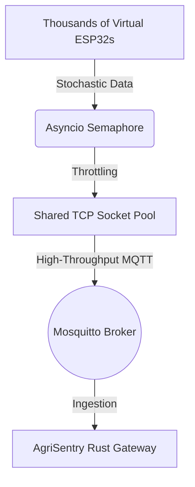

# AgriSentry Advanced Stochastic Load Simulator


High-throughput stochastic stress-injection tool designed to validate and performance-test the limits of the AgriSentry network infrastructure under extreme, realistic AgTech telemetry volumetry. This tool orchestrates thousands of concurrent virtual ESP32 nodes to simulate real-world agricultural conditions and inject mathematically deterministic outliers for downstream AI validation.

## Architectural Design

To simulate mass deployment without crashing host infrastructure, the engine bypasses traditional operating system socket limitations through advanced virtualization mechanics:



* **Virtualization Pooling:** Instead of dedicating individual TCP sockets per simulated edge node (which triggers system file descriptor exhaustion `Too many open files`), the engine routes thousands of virtual devices across a tight pool of stable, shared multiplexed TCP connections.
* **Concurrency Control:** Leverages asynchronous semaphores (`asyncio.Semaphore`) to throttle instantaneous publishing bursts, eliminating infinite internal memory buffering and preventing local event-loop saturation.

## Stochastic Ingestion and Data Quality Modeling

Telemetry parameters do not follow basic linear random distributions. The generator utilizes Mean-Reverting Random Walks to mimic the actual physical inertia of natural environments:

* **Ambient Inertia:** Sensor states (TEMPERATURE, HUMIDITY, SOIL_MOISTURE, LUMINOSITY) float naturally around an environmental baseline using Gaussian noise. The calculation applies a reversion force that pulls the current state back towards the mean baseline on every execution tick.
* **Controlled Anomaly Infiltration:** Based on a configurable probability parameter, the engine injects violent mathematical outliers. These entries intentionally break standard Z-Score limits (> 4.0 standard deviations) to provide raw test mass for the data cleaning worker pipelines in the cloud.

## Contract Protocol Matrix

All data payloads align strictly with the multi-protocol streaming contract expected by the Rust Ingestion Gateway:

* **Dynamic Topic Routing:** `agrisentry/gateway/{VIRTUAL_MAC_ADDRESS}/{SENSOR_TYPE}`
* **Raw Telemetry Payload:** Numeric float entries are converted directly into basic string values (e.g., "62.40") to eliminate JSON parsing overhead over the network.

## Quick Start

### 1. Installation

Ensure you have a virtual environment active, then install the required dependencies:

```bash
python -m venv venv
source venv/bin/activate  # On Windows: venv\Scripts\activate
pip install -r requirements.txt
```

### 2. Execution Interface

The engine features a parameterizable command-line interface (CLI) to control loading factors dynamically.

Run with standard deployment arguments (1,000 virtual devices):

```bash
python main.py
```

Run an intense stress-test scenario injecting 2,000 virtual nodes generating data every 0.5 seconds with a 10% anomaly rate:

```bash
python main.py --devices 2000 --interval 0.5 --anomaly-rate 0.10 --broker-host localhost --broker-port 1883
```

### 3. CLI Argument Reference

* `--devices`: Total number of unique virtual ESP32 nodes to clone and simulate concurrently. Default is 1000.
* `--interval`: Telemetry transmission frequency loop interval in seconds. Default is 1.0.
* `--anomaly-rate`: Statistical probability value (0.0 to 1.0) of injecting a violent outlier during a sensor reading tick. Default is 0.01 (1%).
* `--broker-host`: Target network address of the Mosquitto MQTT broker. Default is 127.0.0.1.
* `--broker-port`: Target port of the Mosquitto MQTT broker. Default is 1883.
